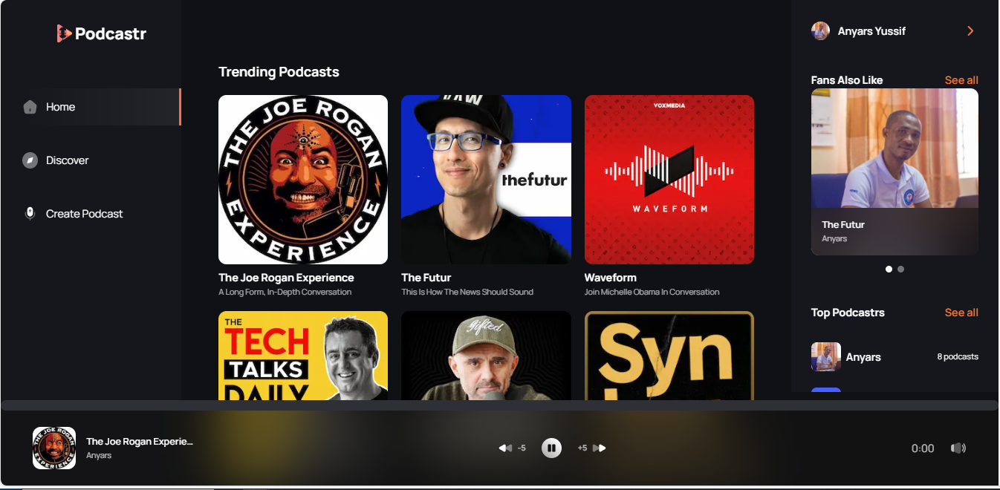

<a name="readme-top"></a>

<div align="center">

 <!-- LOGO -->

  
  <br/>

<!-- MAIN HEADING -->

  <h3><b>Podcastr</b></h3>

</div>

<!-- TABLE OF CONTENTS -->
# 📗 Table of Contents

- [📖 About the Project](#about-project)
  - [🛠 Built With](#built-with)
    - [Tech Stack](#tech-stack)
    - [Key Features](#key-features)
  - [🚀 Live Demo](#live-demo)
- [💻 Getting Started](#getting-started)
  - [Setup](#setup)
  - [Prerequisites](#prerequisites)
  - [Install](#install)
  - [Run tests](#run-tests)
  - [Deployment](#deployment)
- [👥 Authors](#authors)
- [🔭 Future Features](#future-features)
- [🤝 Contributing](#contributing)
- [⭐️ Show your support](#support)
- [🙏 Acknowledgements](#acknowledgements)
- [❓ FAQ (OPTIONAL)](#faq)
- [📝 License](#license)

<!-- INTRO -->
# 📖 Podcastr <a name="about-project"></a>

> This is a Full-stack Podcast project built with NextJS and Convex, that allows users to create podcasts, generate voice and images using AI as well as search and play podcasts.
> generate voice and images

## 🛠 Built With <a name="built-with"></a>
1. Next.js
2. Clerk
3. Radix UI
4. Shadcn
5. Convex
6. Embla-carousel
7. Lucide-react
8. OpenAI
9. React.js
10. Tailwind CSS
11. TypeScript
12. Uploadstuff

### Tech Stack <a name="tech-stack"></a>

<details>
  <summary>Client</summary>
  <ul>
    <li><a href="https://nextjs.org/">Next.js</a></li>
    <li><a href="https://clerk.com/">Clerk</a></li>
    <li><a href="https://www.radix-ui.com/">Radix UI</a></li>
    <li><a href="https://ui.shadcn.com/">Shadcn</a></li>
    <li><a href="https://docs.convex.dev/home">Convex</a></li>
    <li><a href="https://www.embla-carousel.com/">Embla-carousel</a></li>
    <li><a href="https://lucide.dev/guide/packages/lucide-react">Lucide-react</a></li>
    <li><a href="https://platform.openai.com/docs/overview">OpenAI</a></li>
    <li><a href="https://react.dev/">React.js</a></li>
    <li><a href="https://tailwindcss.com/">Tailwind CSS</a></li>
    <li><a href="https://www.typescriptlang.org/">TypeScript</a></li>
    <li><a href="https://www.typescriptlang.org/">Uploadstuff</a></li>
  </ul>
</details>

<!-- Features -->

### Key Features <a name="key-features"></a>

👉 **Create Podcasts**: Includes Voice and Image generation using AI.

👉 **User Authentication**: Intuitive User registration, authetication and confirmation using clerk.

👉 **Discover Page**: Allows users to search and play podcasts.

👉 **Play Podcasts**: Allows usesr to play their favourite selected podcasts.

<p align="right">(<a href="#readme-top">back to top</a>)</p>

<!-- LIVE DEMO -->

LIVE DEMO

> Visit the [live](https://anyars-podcastr.vercel.app/) page of the project.

<p align="right">(<a href="#readme-top">back to top</a>)</p>

<!-- GETTING STARTED -->

## 💻 Getting Started <a name="getting-started"></a>

> To get a local copy up and running, follow these steps.
> 
```sh
cd podcastr
https://github.com/anyars-encarta/podcastr.git
```

### Prerequisites

1. A Browser (Preferably Google Chrome)
2. A Code Editor
3. Internet Connection
4. Git

<!-- SETUP -->
### Setup

To run the project, run the following command:

```sh
cd podcastr
  npx convex dev 
  npm run dev
```

<!-- INSTALL -->

### Install

Install this project with the latest version of Git and a code editor.

### Deployment

You can deploy this project using:
>1. A Code Editor
>2. Latest version of Git

<p align="right">(<a href="#readme-top">back to top</a>)</p>

<!-- AUTHORS -->
## 👥 Authors <a name="authors"></a>

👤 **Anyars Yussif**

- GitHub: [@anyars-encarta](https://github.com/anyars-encarta)
- Twitter: [@anyarsencarta](https://twitter.com/anyarsencarta)
- LinkedIn: [LinkedIn](https://www.linkedin.com/in/anyars-yussif/)


<p align="right">(<a href="#readme-top">back to top</a>)</p>

## 🔭 Future Features <a name="future-features"></a>

- [ ] **Add video podcasts**

<p align="right">(<a href="#readme-top">back to top</a>)</p>

<!-- CONTRIBUTION -->
## 🤝 Contributing <a name="contributing"></a>

Contributions, issues, and feature requests are welcome!

<p align="right">(<a href="#readme-top">back to top</a>)</p>

<!--SUPPORT -->

## ⭐️ Show your support <a name="support"></a>

> If you like this project, please give it some starts ⭐️⭐️⭐️⭐️⭐️

<p align="right">(<a href="#readme-top">back to top</a>)</p>

<!-- ACKNOWLEDGEMENTS -->
## 🙏 Acknowledgments <a name="acknowledgements"></a>

> Special acknowledgement to [@adrianhajdin](https://github.com/adrianhajdin) and [@microverseinc](https://github.com/microverseinc)

<p align="right">(<a href="#readme-top">back to top</a>)</p>

<!-- FAQS -->
## ❓ FAQ (OPTIONAL) <a name="faq"></a>

- **How were the Linters utilised?**

  - The Linters were utilised with the help of resources provided by [@microverseinc](https://github.com/microverseinc).

- **What new features should be expected in the next release of the project?**

  - I am currently working on adding **video podcasts**.

<p align="right">(<a href="#readme-top">back to top</a>)</p>

<!-- LICENSE -->

## 📝 License <a name="license"></a>

This project is [MIT](./LICENSE) licensed.

<p align="right">(<a href="#readme-top">back to top</a>)</p>
